# Welcome to Niche Art & Toys!
Niche Art & Toys is an independently owned bussiness offering a carefully curated selection of handcrafted toys, watercolor paintings, and modern calligraphy pieces. Our platform caters to art lovers, collectors, and those seeking the perfect, heartfelt gift.

# **Table Of Contents**

* [**Planning Phase**](#planning-phase)
  * [**Strategy**](#strategy)
    * [**Service Aims:**](#service-aims)
    * [**Opportunities:**](#opportunities)
  * [**Scope**](#scope)
  * [**Structure**](#structure)
    * [**User Stories:**](#user-stories)
  * [**Skeleton**](#skeleton)
    * [**Wireframes:**](#wireframes)
    * [**User Flow Diagram:**](#user-flow-diagram)
    * [**Database Schema**](#database-schema)
  * [**Surface**](#surface)
    * [**Color Schema:**](#color-scheme)
    * [**Typography:**](#typography)
* [**E-commerce Application Type**](#e-commerce-application-type)
* [**Marketing Strategies**](#marketing-strategies)  
* [**SEO considerations**](#seo-considerations)
* [**Agile Development Process**](#agile-development-process)
* [**Features**](#features)
* [**User Experience (UX)**](#user-experience-ux)
  * [**Design Philosophy**](#design-philosophy)
* [**Technologies Used**](#technologies-used)
  * [**Front-End Technologies:**](#front-end-technologies)
  * [**Back-End Technologies:**](#back-end-technologies)
* [**Testing Phase**](#testing-phase)
* [**Deployment**](#deployment)
* [**Future Development**](#future-development)
* [**Credits**](#credits)
  * [**Acknowledgements:**](#acknowledgements)


# Planning Phase

## Strategy
### Service Aims
Our service aims focus on delivering exceptional value to our customers through:

1. **Quality and Craftsmanship**: Ensuring every product meets high standards of quality and uniqueness.
2. **Customer Experience**: Providing a seamless and satisfying shopping experience from browsing to checkout.
3. **Sustainability**: Committing to eco-friendly practices in production and packaging to minimize our environmental impact.
4. **Community Engagement**: Creating a vibrant community of artists and art lovers through interactive events and social media engagement.
5. **Innovation**: Continuously improving and innovating our product offerings and user interface based on customer feedback and market trends.

### Opportunities:
The current market and technological landscape present several opportunities for Niche Art & Toys:

1. **Growing Interest in Handcrafted Goods**: Capitalizing on the increasing consumer preference for handcrafted and artisan products over mass-produced items.
2. **E-commerce Expansion**: Utilizing advancements in e-commerce technology to reach a broader audience globally and enhance user experience.
3. **Social Media Marketing**: Leveraging powerful social media platforms and influencer partnerships to increase brand awareness and customer loyalty.
4. **Personalization Trend**: Offering customized products and services to meet the rising demand for personalized shopping experiences.
5. **Artistic Collaboration**: Expanding our product range by collaborating with emerging artists and designers to keep our offerings fresh and exciting.


## Scope

### Project Definition
Niche Art & Toys aims to create an engaging online marketplace for art enthusiasts, collectors, and gift buyers. Our platform will offer handcrafted toys, watercolor paintings, and modern calligraphy pieces, focusing on providing high-quality, unique products.

### Product Range
- **Handcrafted Toys**: Specializing in crochet and fabric toys, perfect for children and collectors.
- **Watercolor Paintings**: Offering original watercolor art, ranging from abstract to realistic styles.
- **Modern Calligraphy Pieces**: Custom and pre-made calligraphy artworks ideal for home decor and gifts.

### Functionalities
- **E-commerce Capabilities**: Complete shopping cart functionality, product searches, user accounts, order management, and payment processing.
- **User Accounts**: Registration, login/logout capabilities, profile management, wishlist and order history.
- **Customer Interaction**: Product rating and comments, contact page.
- **Administration**: Backend functionalities for inventory management.

### Design
- **Responsive Design**: Ensuring the platform is accessible on all devices and screen sizes.
- **User Interface**: Intuitive navigation and attractive layout to enhance user experience.


## Structure
Niche Art & Toys is designed to cater to a diverse user base including art lovers, collectors, and gift buyers. It focuses on creating a user-friendly environment that ensures easy navigation and an intuitive user experience

### User Stories

#### As a Shopper, I want to:
- **View detailed information about each product** so that I can determine if it fits my needs.
- **View a list of all products** so that I can select items to purchase.
- **Sort products by various attributes** such as rating or price to find the best match.
- **Search for products by name or description** so that I can locate a particular item.
- **Sort through specific categories** so that I can quickly find the top products in my area of interest.
- **See the results of my search and the quantity of matches** to assess options.
- **Rate products using a star system** so that I can share my opinion and help others make informed decisions.
- **Review items in my cart before purchasing** so that I can verify the final order.
- **Easily select the quantity of a product when making purchases** so that I can ensure I get exactly what I need.
- **Easily see my potential spending** so that I can manage my budget.
- **Adjust quantities or remove items in my cart** for last-minute decisions.
- **Enter payment information on a secure page** to ensure data safety.
- **See a summary of the order upon completion** to confirm purchase details.
- **Receive an email confirmation after purchase** to keep a record of the transaction.
- **Add items to a Wishlist** to save for later or monitor price changes.
- **Write reviews for products** so that I can provide detailed feedback and insights for other potential customers.
- **Identify deals and limited-time offers** to make the most of discounts and special deals. (Previously missing)

#### As a Site User, I want to:
- **Register for an account effortlessly** to create a personalized shopping experience.
- **Log in or out with ease** to access my account without difficulty.
- **Recover my password smoothly** if I forget it to regain access to my account.
- **Receive confirmation after signing up** to be certain my account is ready.
- **Have my own user profile** to track my orders and save my preferences.
- **Easily access and submit the contact us form** to communicate my queries or issues.

#### As a Store Owner, I want to:
- **Add new products** to expand my store's inventory and offer more options to my customers.
- **Edit/update a product** to change product prices, descriptions, images, and other product criteria to keep my store's inventory accurate and up-to-date.
- **Delete a product** to remove items that are no longer for sale, ensuring that my customers only see currently available products.
- **Promote my products** to build a community around my store and increase customer engagement.


## Skeleton
### Wireframes
#### Home page


#### Main page


#### Product Detail page


#### Shopping Bag page
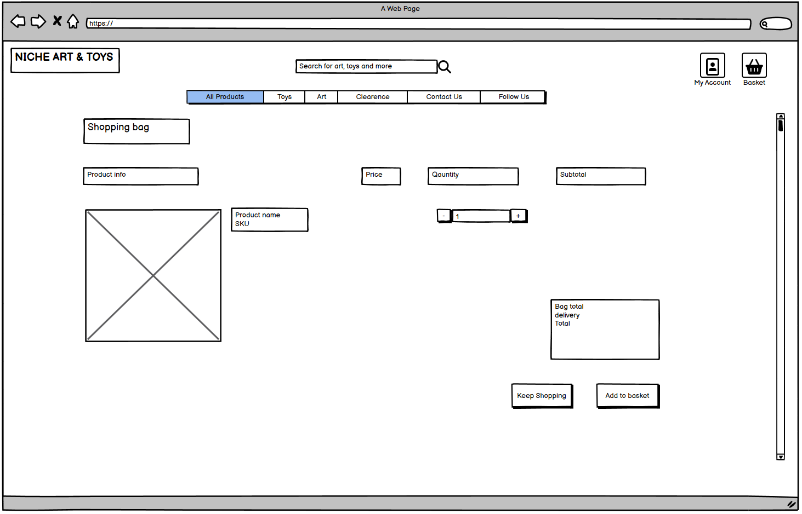

#### Checkout page


#### Mobile wireframes


### User Flow Diagram 


#### Unregistered User
- Browse products.
- Use the "Contact Us" feature.
- Proceed through checkout to place orders.

#### Registered User
- All capabilities of an unregistered user.
- Manage profile.
- Interact with the wishlist.
- Rate and review products.

#### User Registration (Optional)
- User has the option to register at any point, including during checkout.
- Upon registration, the user's details are saved to `UserProfile`.
- Registered users can add products to their `Wishlist`.
- Users can leave ratings and comments on products.

#### Browsing Products (Both Users)
- Products displayed, sortable and filterable through categories.
- View details of each product.

#### Placing an Order (Both Users)
- Add products to the shopping cart.
- Proceed to checkout:
  - **Unregistered User**: Options to continue as a guest or register. If registering, details can be saved to create a `UserProfile`.
  - **Registered User**: Checkout as usual with an option to update their existing profile details.
- Complete payment process, and create `Order` along with `OrderLineItem` records.

#### Using Contact Us (Both Users)
- All users can send messages through the `Contact` entity regardless of registration status.


### Database Schema
#### Entity Relationship Diagram


#### Category Model

| Field         | Type        | Description                                                |
|---------------|-------------|------------------------------------------------------------|
| name          | CharField   | The official name of the category.                         |
| friendly_name | CharField   | A user-friendly name for the category, optional.           |

#### Product Model

| Field         | Type           | Description                                               |
|---------------|----------------|-----------------------------------------------------------|
| category      | ForeignKey     | Link to the Category model, can be null.                  |
| sku           | CharField      | Stock Keeping Unit, optional.                             |
| name          | CharField      | The name of the product.                                  |
| description   | TextField      | Detailed description of the product.                      |
| is_sold       | BooleanField   | True if the product is sold, false otherwise.             |
| is_clearance  | BooleanField   | True if the product is on clearance, false otherwise.     |
| stock_quantity| IntegerField   | The amount of stock available.                            |
| price         | DecimalField   | Current price of the product.                             |
| old_price     | DecimalField   | Original price of the product before any discounts, optional. |
| rating        | DecimalField   | Average rating of the product, optional.                  |
| image_url     | URLField       | URL of the product image, optional.                       |
| image         | ImageField     | Upload field for the product image, optional.             |

#### Rating Model

| Field        | Type          | Description                                         |
|--------------|---------------|-----------------------------------------------------|
| product      | ForeignKey    | Link to the associated Product.                     |
| user         | ForeignKey    | Link to the User who made the rating.               |
| score        | DecimalField  | The score of the rating.                            |
| comment      | TextField     | Additional comments on the rating, optional.        |
| created_at   | DateTimeField | The date and time when the rating was created.      |

#### Wishlist Model

| Field     | Type          | Description                                          |
|-----------|---------------|------------------------------------------------------|
| user      | ForeignKey    | Link to the User who owns the wishlist.              |
| products  | ManyToManyField | Products included in the wishlist.               |

#### UserProfile Model

| Field                  | Type          | Description                                       |
|------------------------|---------------|---------------------------------------------------|
| user                   | OneToOneField | Link to the Django User model.                    |
| default_full_name      | CharField     | Default full name, optional.                      |
| default_phone_number   | CharField     | Default phone number, optional.                   |
| default_street_address1| CharField     | Default street address, optional.                 |
| default_street_address2| CharField     | Additional default street address, optional.      |
| default_postcode       | CharField     | Default postcode, optional.                       |
| default_town_or_city   | CharField     | Default town or city, optional.                   |
| default_county         | CharField     | Default county, optional.                         |
| default_country        | CountryField  | Default country, optional.                        |


### Surface

#### **Color Scheme:**
Below is the primary color palette used in the project, visually represented:

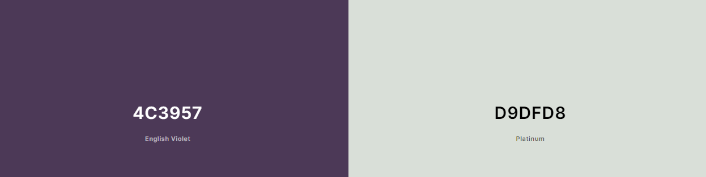

- **Primary body text color**: `#000` - Utilized for main content, ensuring excellent readability against light backgrounds.
- **Button and accent color**: `#4C3957` - A deep, muted purple used for buttons, navigation links, and interactive elements to provide a consistent and elegant interface.
- **Border and active elements color**: `#552C64` - A slightly brighter shade of purple used for borders and active states to subtly distinguish interactive components.
- **Background color for sections**: `#D9DFD8` - A soft gray-green used primarily in backgrounds to create a soothing visual effect and enhance content readability.
- **Text on cards and buttons**: `white` - Ensures high contrast and visibility against darker backgrounds.

#### **Typography:**
- **Primary Font**: `Roboto, sans-serif` - Used extensively throughout the site for its clean, modern appearance. This choice ensures that both body text and headers are legible and aesthetically pleasing.
- **Font Sizes**:
  - General body text follows standard sizing to maintain readability.
  - Headers are scaled appropriately to distinguish section titles from other texts.
- **Special Text Styles**:
  - `.logo-font` - Uppercase transformation for brand-related text to increase impact and recognition.
  - `.text-black` - Applies the primary text color for emphasized text outside the standard body content.

#### **Buttons and Interactive Elements:**
- **Standard Buttons**: Utilize a deep purple background with white text, ensuring they stand out on various backgrounds.
- **Outline Buttons**: Display a white background with a purple border, switching to a purple background on hover or active states to signal interactivity.
- **Icon Usage**: Icons are aligned within buttons and navigation links for visual enhancement and to support user navigation intuitively.

#### **Navigation:**
- **Primary Navigation**: Styled with a background color of `#D9DFD8` to stand out from the main content area. Text and icons in `#4C3957` provide a consistent and accessible user interface.
- **Dropdown Menus**: Utilize the same color palette as the primary navigation for consistency, with items becoming highlighted on hover to improve user experience.

#### **Background and Layout:**
- **Main Background**: Utilizes a full-cover image to create a visually engaging experience right from the start.
- **Content Cards**: Styled with white backgrounds to contrast with the primary purple accents, ensuring that information is easy to read and visually separated from other page elements.

#### **Forms and Inputs:**
- **Form Backgrounds**: Generally maintain a light color to ensure that text inputs are easily visible.
- **Input Fields**: Outlined in the accent color to maintain thematic consistency and visual coherence across form elements.


# E-commerce Application Type
Our platform operates on a Business-to-Consumer (B2C) model, focusing on direct sales between the business and individual consumers. This model is ideal for our niche of handmade crochet toys, used toys, and painted pictures, as it allows us to build personal connections with our customers and provide them with a tailored shopping experience. Here are some characteristics of our B2C model:
- **Direct Interaction**: We engage directly with end users, not businesses, which simplifies the buying process and enhances user experience.
- **Customer Base**: Our primary audience includes gift buyers, parents, collectors, and art enthusiasts who appreciate unique and personalized products.
- **Marketing Strategies**: Tailored to appeal to individual needs and preferences, leveraging targeted advertising, social media engagement, and personalized email campaigns.
- **Customer Support**: Focused on providing excellent customer service to enhance satisfaction and encourage repeat business.
- **Transaction Process**: Designed to be fast and user-friendly, ensuring a seamless checkout experience for all users.

This B2C setup allows us to effectively manage customer relationships and respond quickly to market trends and individual feedback, driving the growth of our online eShop.


# Marketing Strategies

### User Analysis
- **Target Audience**: Gift buyers, parents of young children, collectors, and art enthusiasts.
- **Preferred Platforms**: Etsy, Pinterest, Instagram, Facebook.


### 1. Social Media Marketing
- **Platforms**: Facebook, Twitter, Instagram, Pinterest
- **Activities**: 
  - Regular updates featuring new products and behind-the-scenes content.
  - Seasonal promotions highlighted through Facebook Stories and Pinterest boards.
  - Active community engagement by responding to comments and encouraging shares.

### 2. Content Marketing
- **Method**: Blogging and informative articles.
- **Content Ideas**:
  - "The Art of Crochet: How Our Toys Are Made"
  - "Guide to Caring for Your Handmade Toys"
  - Articles on the benefits of handmade vs. mass-produced toys.
- **Distribution**: Content to be shared across social media platforms and included in email newsletters.

### 3. Email Marketing
- **Strategy**: Use of subscription-based newsletters to engage customers.
- **Features**:
  - Monthly updates on new product launches, behind-the-scenes content, and exclusive offers.
  - Early access to sales and special events for subscribers.

### 4. Influencer Marketing
- **Target**: Parenting bloggers, lifestyle influencers, and artists who align with our brand values.
- **Approach**:
  - Collaborations to showcase real-life uses of our products, enhancing trust and authenticity.

### 5. SEO (Search Engine Optimization)
- **Focus**: On-page optimization and targeting local SEO.
- **Keywords**: "handmade crochet toys", "eco-friendly children's toys", "custom painted pictures".
- **Goal**: Improve search engine rankings to increase organic traffic.

### 6. Paid Advertising
- **Platforms**: Google Ads and Facebook Ads.
- **Types**:
  - Use of retargeting ads to re-engage visitors.
  - Creation of lookalike audiences to expand our customer base.

### 7. Sales Promotions and Discounts
- **Promotions**:
  - Offering seasonal discounts and special holiday sales.
- **Communication**: Promotion details to be announced via social media, email, and on our website.

### Goals and Budget
- **Objectives**: Increase brand visibility, drive online sales, expand the customer base, and build a strong community around our products.
- **Budget Strategy**: Initiate with cost-effective methods like social media and content marketing, scaling into paid advertising as revenue increases.


## SEO Considerations
### Keywords Strategy
To optimize our website's search engine rankings and attract a targeted audience, we have carefully selected keywords using tools like Google Trends to analyze search volumes and relevancy. Our keyword strategy is designed to capture a diverse audience by focusing on three priority levels based on search volume and relevance to our core products and target audiences.

#### Core Products
Our primary products, which are central to our SEO efforts, include:
- `handmade toys`
- `crochet toys`
- `watercolor paintings`
- `modern calligraphy`
- `personalized gifts`
- `unique gifts`

#### Target Audiences
We aim to reach specific customer segments who are most likely to be interested in our products:
- `gifts for children`
- `art for kids`
- `home decor art`
- `toys for toddlers`
- `handmade gifts`
- `unique baby gifts`

#### Values & Benefits
These keywords emphasize the unique selling propositions and ethical aspects of our products:
- `eco-friendly toys`
- `sustainable art`
- `educational toys`
- `handmade art`
- `artisan crafts`
- `creative gifts`

#### Medium-Priority Keywords
These keywords have moderate search volumes and relevance, making them crucial for capturing interested leads:
- `art toys`
- `decorative crafts`
- `nursery decor`
- `wall art`
- `children's gifts`
- `baby shower gifts`
- `handmade home decor`
- `art prints`

#### Lower-Priority Keywords
Niche or trending keywords that may attract specific sub-segments of our target audience:
- `Montessori toys`
- `Waldorf toys`
- `crochet animal toys`
- `abstract watercolor art`
- `calligraphy quotes`
- `personalized nursery art`

### Technical SEO
To complement our keyword strategy, we employ a `robots.txt` file and a sitemap, ensuring that search engines can effectively index and crawl our site. This infrastructure supports the discoverability of our niche art and toys, enhancing visibility across various search platforms.

#### Meta Tag Example
To illustrate how these keywords integrate into our site's HTML, here is an updated `<meta name="keywords">` tag reflecting our SEO strategy:

```html
<meta name="keywords" content="handmade toys, crochet toys, watercolor paintings, modern calligraphy, personalized gifts, unique gifts, gifts for children, art for kids, home decor art, toys for toddlers, handmade gifts, unique baby gifts, eco-friendly toys, sustainable art, educational toys, handmade art, artisan crafts, creative gifts, art toys, decorative crafts, nursery decor, wall art, children's gifts, baby shower gifts, handmade home decor, art prints, Montessori toys, Waldorf toys, crochet animal toys, abstract watercolor art, calligraphy quotes, personalized nursery art">
```

# Agile Development Process
### Overview
### Introduction
This project, designed to deliver a dynamic e-commerce platform specializing in art and toys, adopted the Agile methodology to ensure flexibility and adaptability. My approach emphasized continuous iteration of development and testing throughout the project lifecycle.

### User Stories
My development was guided by a series of user stories grouped by functionality to ensure a user-centric design and development approach. Here are the categories and their respective user stories:

### Viewing and Navigation
- **As a Shopper:**
  - I want to **view a list of all products** so that I can **select items to purchase**.
  - I want to **view detailed information about each product** so that I can **determine if it fits my needs**.
  - I want to **identify deals and limited-time offers** so that I can **make the most of discounts and special deals**.
  - I want to **easily see my potential expenditures** so that I can **manage my budget**.
  - I want to **sort products by various attributes** such as rating or price so that I can **find the best match for my preferences**.
  - I want to **sort through a specific category** so that I can **quickly find the top products in my area of interest**.
  - I want to **search for products by name or description** so that I can **locate a particular item I wish to buy**.
  - I want to **see the results of my search** and the **quantity of matches** so that I can **assess my options**.

### Registration and User Accounts
- **As a Site User:**
  - I want to **register for an account effortlessly** so that I can **create a personalized shopping experience**.
  - I want to **log in or out with ease** so that I can **access my account without difficulty**.
  - I want to **recover my password smoothly** if I forget it so that I can **regain access to my account**.
  - I want to **receive confirmation after signing up** so that I can **be certain my account is ready**.
  - I want to **have my own user profile** so that I can **track my orders and save my preferences**.

### Purchasing and Checkout
- **As a Shopper:**
  - I want to **easily select the quantity of a product** when purchasing it so that I can **ensure I get exactly what I need**.
  - I want to **review items in my cart before purchasing** so that I can **verify my final order**.
  - I want to **adjust quantities or remove items in my cart** so that I can **make last-minute decisions**.
  - I want to **enter my payment information on a secure page** so that I can **trust that my data is safe**.
  - I want to **see a summary of my order upon completion** so that I can **confirm my purchase details**.
  - I want to **receive an email confirmation after my purchase** so that I can **keep a record of my transaction**.
  - I want to **rate products using a star system** so that I can **share my opinion and help others make informed decisions**.
  - I want to **write reviews for products I've purchased** so that I can **provide detailed feedback and insights for other potential buyers**.

### Store Management and Engagement
- **As a Store Owner:**
  - I want to **add new products** so that I can **expand my store's inventory and offer more options to my customers**.
  - I want to **edit/update a product** so that I can **change product prices, descriptions, images, and other product criteria** to keep my store's inventory accurate and up-to-date.
  - I want to **delete a product** so that I can **remove items that are no longer for sale**, ensuring that my customers only see currently available products.
  - I want to **promote my products** to **build a community around my store** and **increase customer engagement**.

### Additional User Interaction
- **As a Site User:**
  - I want to **easily access and submit the contact us form** so that I can **communicate my queries or issues and receive support**.
- **As a Shopper:**
  - I want to **add items to a Wishlist** so that I can **save them for later or monitor price changes**.

### Rejected User Stories
- **As a Site User:**
  - I want to **create a blog post** so that I could **share my expertise and knowledge about art**. (Rejected)
- **As a Site User:**
  - I want to **comment on blog posts** so that I could **engage in discussions and interact with the community**. (Rejected)
  
- **As an Art Enthusiast:**
  - I want to **register for art workshops or events** so that I could **engage with the art community and enhance my skills**. (Rejected)
  
- **As a Shopper:**
  - I want to **submit requests for custom art pieces** so that I could **purchase art that meets my specific preferences**. (Rejected)


### Agile Practices Employed

#### Agile Tools and Practices
- [**Kanban Board:**](https://github.com/matus42/Niche-Art-Toys/issues) Initially using a written plan, the project later transitioned to a digital Kanban board for better visual organization and future planning.
- **Daily Standups:** Held daily standups to set goals and review achievements, fostering a disciplined approach to self-management.
- **User Stories:** Focused development on directly serving user needs and enhancing user experience.
- **Retrospectives:** Conducted at the end of each sprint to reflect on achievements and areas for improvement.

#### Continuous Feedback and Adaptation
- Integrated feedback loops throughout the development by presenting working versions to mentor and peers, allowing for real-time feedback and adjustments.

#### Overall Reflection on Planned Days and Agile Methodology

The beginning of this project was marked by a sense of apprehension due to its ambitious scope. Initially, the vast array of tasks seemed daunting. However, the structured flexibility of Agile methodologies helped to demystify the complexities and render the project manageable. By breaking down the work into smaller, digestible sprints, Agile allowed us to maintain focus and adapt to challenges methodically and incrementally.

#### Key Learnings and Future Directions
- **Enhanced Detail in User Stories:** Early in the project, I realized that some user stories were not detailed enough, leading to complexities during sprints. For future projects, I am committed to crafting more detailed user stories from the outset. This will provide clearer guidance for the team and facilitate smoother sprint executions.

- **Commitment to Iterative Notes:** One area I identified for improvement is in the documentation of each sprint. Previously, I did not maintain detailed notes during sprints, which sometimes made it challenging to track changes and understand decisions in hindsight. Moving forward, I will implement a systematic approach to note-taking after each iteration. This will enhance our ability to reflect, adjust, and plan more effectively.

- **Strategic Planning and Resource Allocation:** Reflecting on the project, I recognize the need for better resource allocation and strategic planning. Certain aspects required more time and resources than anticipated. Enhanced planning will be a focus in future projects to ensure that I'm prepared for and can efficiently manage complex tasks.

#### Admiration for Agile's Flexibility
Throughout this project, the flexibility of Agile has stood out as a key advantage. It allowed me to pivot as needed and respond to challenges without significant setbacks. This adaptability was not only crucial for project success but also instrumental in maintaining high my morale and fostering an environment of creative problem-solving.

#### Conclusion
This project has been a profound learning experience, underscored by the powerful role of Agile methodologies in managing complex projects. As I prepare for future endeavors, I am equipped with deeper insights into project management and a renewed focus on continuous improvement. The next projects will see a more robust application of Agile practices, including detailed sprint notes and precise user story definitions, ensuring even greater adaptability and project success.


### Looking Forward
The use of Agile methodology significantly enhanced project flexibility and responsiveness. This experience will inform and improve future project management and development strategies.


## Sprint Details

### Sprint 1: User Authentication Sprint 

#### Goals
- Establish a secure and efficient user authentication system to enhance security and personalize user experience.

#### User Stories Implemented
- **As a Site User:** I want to receive confirmation mail after signing up so that I can be certain my account is ready. (Must have)
- **As a Site User:** I want to register for an account effortlessly so that I can create a personalized shopping experience.
- **As a Site User:** I want to recover my password smoothly if I forget it so that I can regain access to my account.
- **As a Site User:** I want to log in or out with ease so that I can access my account without difficulty.

### Sprint 2: Product Discovery Sprint

#### Goals
- Enable customers to discover products easily and make informed purchasing decisions.

#### User Stories Implemented
- **As a Shopper:** I want to view detailed information about each product so that I can determine if it fits my needs.
- **As a Shopper:** I want to view a list of all products so that I can select items to purchase.
- **As a Shopper:** I want to sort products by various attributes such as rating or price so that I can find the best match for my preferences.
- **As a Shopper:** I want to search for products by name or description so that I can locate a particular item I wish to buy.
- **As a Shopper:** I want to sort through a specific category so that I can quickly find the top products in my area of interest.
- **As a Shopper:** I want to see the results of my search and the quantity of matches so that I can assess my options.
- **As a Shopper:** I want to rate products using a star system so that I can share my opinion and help others make informed decisions.

### Sprint 3: Shopping Cart Management Sprint

#### Goals
- Enhance the shopping cart experience to allow users to manage their purchases effectively.

#### User Stories Implemented
- **As a Shopper:** I want to review items in my cart before purchasing so that I can verify my final order.
- **As a Shopper:** I want to easily select the quantity of a product when purchasing it so that I can ensure I get exactly what I need.
- **As a Shopper:** I want to easily see my potential spending so that I can manage my budget.
- **As a Shopper:** I want to adjust quantities or remove items in my cart so that I can make last-minute decisions.
- **As a Shopper:** I want to identify deals and limited-time offers so that I can make the most of discounts and special deals.

### Sprint 4: Secure Checkout Sprint

#### Goals
- Implement a secure and user-friendly checkout process.

#### User Stories Implemented
- **As a Shopper:** I want to see a summary of my order upon completion so that I can confirm my purchase details.
- **As a Shopper:** I want to enter my payment information on a secure page so that I can trust that my data is safe.
- **As a Shopper:** I want to write reviews for products so that I can provide detailed feedback and insights for other potential customers.
- **As a Shopper:** I want to add items to a Wishlist so that I can save them for later or monitor price changes.
- **As a Shopper:** I want to receive an email confirmation after my purchase so that I can keep a record of my transaction.
- **As a Site User:** I want to have my own user profile so that I can track my orders and save my preferences.

### Sprint 5: Store Management and Engagement Sprint

#### Goals
- Enhance store management capabilities and engage more effectively with the community.

#### User Stories Implemented
- **As a Store Owner:** I want to add new products so that I can expand my store's inventory and offer more options to my customers.
- **As a Store Owner:** I want to edit/update a product so that I can change product prices, descriptions, images, and other product criteria to keep my store's inventory accurate and up-to-date.
- **As a Store Owner:** I want to delete a product so that I can remove items that are no longer for sale, ensuring that my customers only see currently available products.
- **As a Store Owner:** I want to promote my products to build a community around my store and increase customer engagement.
- **As a Site User:** I want to easily access and submit the contact us form so that I can communicate my queries or issues and receive support.


# User Experience (UX)

## Design Philosophy
At Niche Art & Toys, our design philosophy centers on creating an engaging and seamless shopping experience that reflects the uniqueness and craftsmanship of our products. We prioritize clarity, beauty, and functionality, making sure that each interaction on our platform is intuitive and enjoyable. Our goal is to make art and toy shopping accessible and appealing to everyone, regardless of their familiarity with online shopping.

## Key UX Considerations

### Intuitive Navigation
- **Implementation**: Navigation is designed to be straightforward and easy to use. Categories are clearly labeled, and product search functionality is robust, allowing users to quickly find specific items or browse categories of interest.
- **Impact**: This approach minimizes user effort and enhances satisfaction by making the discovery of products as simple and direct as possible.

### Responsive Design
- **Implementation**: Utilizing Bootstrap for front-end framework ensures that website is responsive and adjusts beautifully across all devices, from desktops to smartphones.
- **Impact**: This ensures that all users have a consistent and enjoyable experience, whether they are at home or on the go, facilitating access from any device.

### Accessibility
- **Implementation**: We adhere to WCAG (Web Content Accessibility Guidelines) and use tools like WAVE to evaluate and enhance accessibility. This helps us identify and fix issues related to navigation, color contrast, text alternatives, and more.
- **Impact**: These practices make platform usable for people with a wide range of disabilities, ensuring that everyone can explore, select, and purchase our unique products.

### Feedback Loops
- **Implementation**:The platform provides immediate, clear feedback for user interactions. Whether a customer adds an item to their cart, completes a purchase, or needs to fill out missing information on a form, they receive instant and understandable feedback.
- **Impact**: Enhances user confidence and reduces frustration by ensuring users are always informed about the outcome of their actions and what steps they need to take next.

## Future UX Goals
As the website continue to grow, our commitment to delivering an outstanding user experience remains a top priority. Upcoming enhancements include:
- **Personalized Shopping Experiences**: Leveraging user data to offer personalized product recommendations and content.
- **Enhanced Mobile Experience**: Given the increasing prevalence of mobile shopping, we plan to further optimize our mobile interfaces to ensure faster loading times and more intuitive interactions.

Our aim is not just to meet user expectations but to exceed them, continuously incorporating user feedback and the latest UX developments into our platform improvements.

## Technologies Used

### Front-End Technologies:
- **HTML5**: Used for structuring the content and layout of the web pages.
- **CSS3**: Utilized for styling the web pages, enabling responsive design.
- **JavaScript**: Employed to add interactivity to the web pages.
- **Bootstrap 4.6**: A front-end framework used for creating responsive and mobile-first websites.

### Back-End Technologies:
- **Django 3.2.25**: The core web framework used for building the project, offering robust security and scalability.
- **Django Allauth 0.41.0**: Integrated for comprehensive authentication, registration, and account management capabilities.
- **Django Countries 7.2.1**: Provides a country field for Django models and forms.
- **Django Crispy Forms 1.14.0**: Used for rendering forms in a DRY way.
- **Django Storages 1.14.2** & **Boto3 1.34.97**: Configured to link with AWS S3 for static and media storage, ensuring efficient content delivery.
- **Psycopg2 2.9.9**: Utilized as the PostgreSQL database adapter for Django.
- **Gunicorn 22.0.0**: Chosen as the WSGI HTTP server to run Python web applications.
- **Stripe 9.4.0**: Integrated for handling secure payment processes.

### APIs and Cloud Services:
- **AWS S3 (via Boto3 and Django Storages)**: Used for storing static files and user-uploaded content.
- **Stripe API**: For processing payments securely.

### Development and Deployment Tools:
- **Git**: Employed for version control to manage and track changes in the source code.
- **Heroku**: Used for deploying the application to a live environment.
- **dj-database-url 0.5.0**: Provides a Django utility that allows you to utilize the `DATABASE_URL` environment variable to configure your Django application.

### Utilities and Extensions:
- **Pillow 10.3.0**: The Python Imaging Library adds image processing capabilities to your Python interpreter.
- **Python Dateutil 2.9.0.post0**: Provides powerful extensions to the standard datetime module.
- **Typing Extensions 4.11.0**: Backported and experimental type hints for Python.

### Other Libraries:
- **Requests 2.31.0**: Allows HTTP requests to be sent easily.
- **Urllib3 2.2.1**: A powerful HTTP client for Python.
- **SQLparse 0.5.0**: A non-validating SQL parser module for Python to clean up and parse SQL queries.
- **OAuthlib 3.2.2** & **Requests-OAuthlib 2.0.0**: These libraries are used to implement OAuth1 and OAuth2 providers and integrate with Django.

### Additional Front-End Components:
- **Meta Tags and SEO**: Used for SEO optimization and metadata management.
- **Google Fonts**: Integrated to enhance typography.
- **Static Files**: Managed using Django's static files management system.
- **JavaScript Libraries**: Utilized for additional functionalities and interactive features.

# Features
### Navbar Dropdown Menus Overview

| Main Menu Item | Dropdown Links               | Description                                           |
|----------------|------------------------------|-------------------------------------------------------|
| Search Bar     | -                            | A text field allowing users to search for art, toys, and more |
| My Profile     | My Profile                   | View and edit the user's profile                      |
|                | Wishlist                     | Access the user's wishlist                            |
|                | Logout                       | Log out of the current user session                   |
|                | Register (Non-authenticated) | Navigate to the user registration page                |
|                | Login (Non-authenticated)    | Navigate to the login page for existing users         |
| Shopping Bag   | -                            | View the contents of the shopping bag and total cost  |
| All Products   | By Price                     | Sort products by price in ascending order             |
|                | By Rating                    | Sort products by rating in descending order           |
|                | By Category                  | Sort products by category in alphabetical order       |
|                | All Products                 | View all products                                     |
| Toys           | Crochet Toys                 | View crochet toys only                                |
|                | Used Toys                    | View used toys only                                   |
|                | All Toys                     | View all toys including all subcategories             |
| Art            | Watercolour Paintings        | View watercolor paintings only                        |
|                | Modern Calligraphy           | View modern calligraphy artworks only                 |
|                | All Art                      | View all art items across specified categories        |
| Clearance      | -                            | View clearance items                                  |
| Contact Us     | -                            | Navigate to the contact page                          |
| Follow Us      | Facebook                     | Link to our Facebook page                             |
|                | Twitter                      | Link to our Twitter page                              |
|                | Instagram                    | Link to our Instagram page                            |
|                | Pinterest                    | Link to our Pinterest page                            |

#### Desktop View
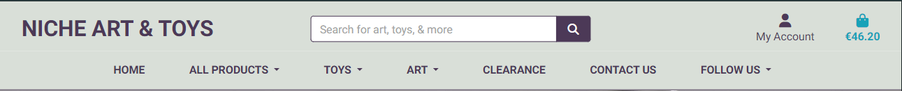

#### Mobile View


#### Footer
- Newsletter subscription, social media links and privacy policy.
- When a new user subscribes to the email newsletter, the admin can view their details through the Mailchimp "Audience" panel.

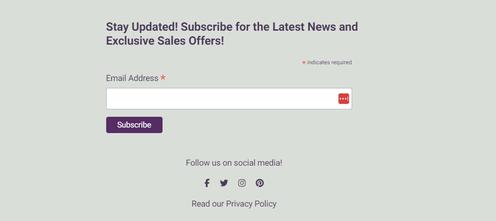

#### Home Page
- When a user clicks "Shop Now," they are directed to the product page. 

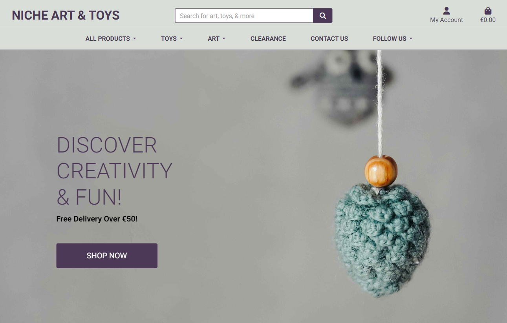

#### Registration
- Users who don't have an account can sign up by filling out a registration form.
- A confirmation email is sent to verify their email address.
- Once registered, users can log in using either their username or email along with their password.
- If a user forgets their password, they can easily initiate a password reset by entering their email address. A link to reset the password will then be sent to their email.

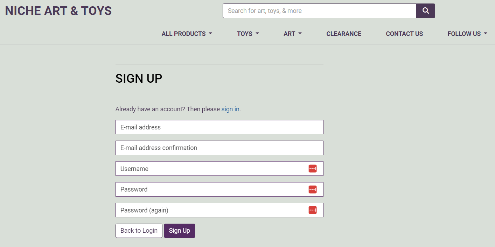

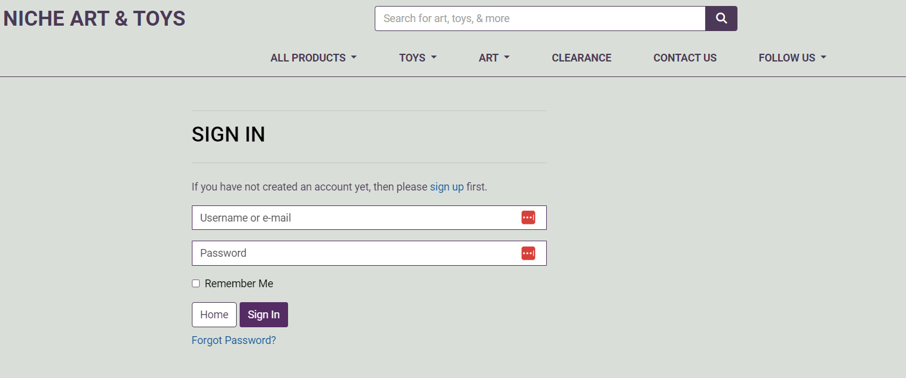

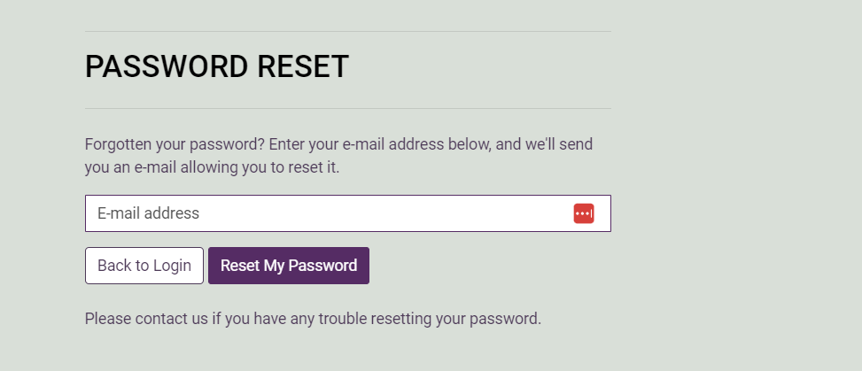

#### Main Page
- Product Display: The main page showcases all listed products, each presented within its own card. This includes essential details such as the product's name, price, category, and rating.
- Sorting Options: Users can sort products based on various criteria, enhancing the shopping experience by allowing them to easily find products that meet their preferences.
- Availability Status: Each product card displays its availability, informing users about which items are in stock.
- Admin Features: For users logged in as admins, each product card includes options to edit or delete products, facilitating easy management directly from the main page.

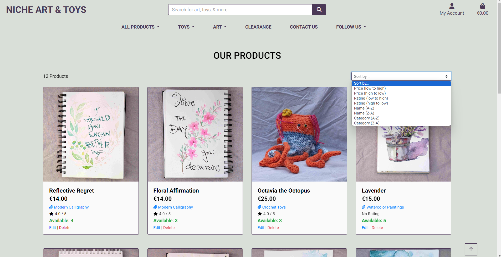

- Clearance Setup: Admins can manually set products to clearance by editing the product details. They calculate a 30% discount off the original price, enter this new sale price in the product edit form, and leave the original price visibly crossed out to show the discount.
- Stock Count: The system tracks the available stock for each product. When a product's stock reaches zero, it is automatically marked as "Out of Stock," and the "Add to Cart" button is disabled to prevent further purchases. This ensures that product availability is always accurately represented to users.


#### Clearence Page
- Dedicated Clearance Page: Users can access clearance products through a dedicated link in the main navbar. This page aggregates all products currently on clearance.
- Product Details: Clicking on a product redirects the user to its detailed product page, where they can view comprehensive information about the item.

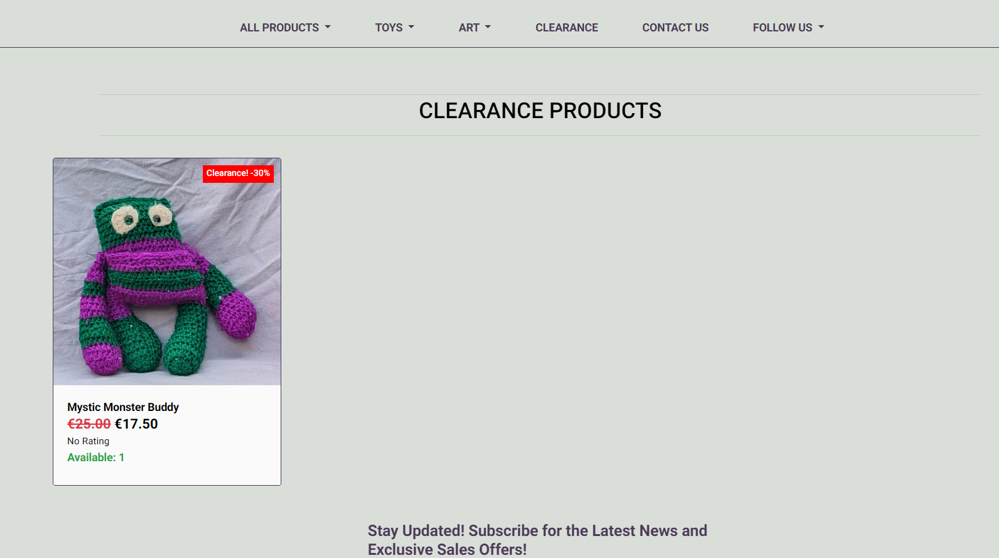

#### Product Detail
- Detailed View: The product detail page offers a comprehensive view of individual items, showcasing high-quality images and detailed descriptions.
- Stock Management: Users can adjust the purchase quantity, but only up to the available stock level. This ensures that orders reflect current inventory limits.
- Wishlist Integration: For logged-in users, there is an option to add items to their wishlist. This feature facilitates easy access to preferred items for future purchases.
- When a user adds an item to their shopping bag, a toast notification appears, providing a brief summary of their current bag contents and a direct link to proceed to checkout. This notification displays the total cost (excluding delivery), with a prompt encouraging the user to spend more to qualify for free next-day delivery. Users can either click on the notification to be taken directly to the checkout page or close the notification. If not manually closed, the notification automatically fades away after 15 seconds, ensuring a smooth and shopping experience.

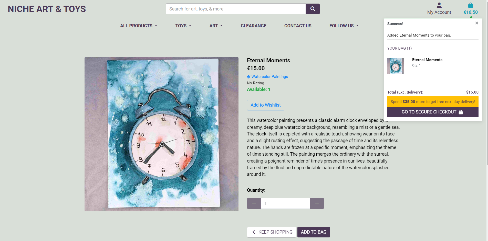

#### Product Rating
- Logged-in users have the ability to rate products and optionally add comments on the product detail page.
- All visitors can view ratings and comments.
- Users who have submitted a rating or comment can edit or delete their own entries. If a user chooses to delete a rating, a confirmation modal appears to ensure the action is intentional, preventing accidental deletions.
- Admin Privileges: Admins can edit or delete any ratings and comments, ensuring the ability to manage content site-wide effectively.
- Upon submitting a rating, users receive a toast notification confirming the action, which enhances the interactive experience and provides immediate feedback on the submission process.
- The average rating for each product is dynamically updated based on user submissions, and this rating is displayed on the product listing.

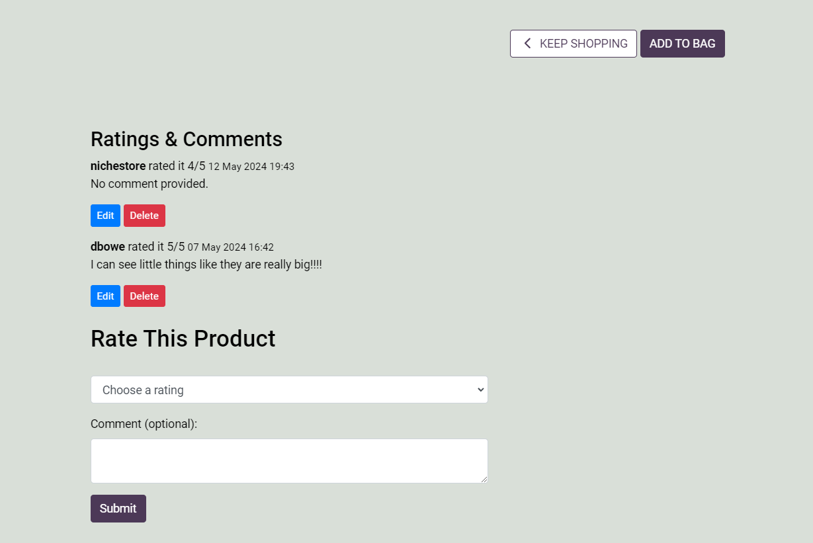

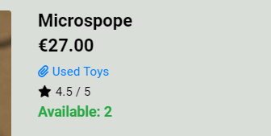

#### Shopping Bag
- Users can access their shopping bag by clicking on the shopping bag icon located in the upper right corner of the page, or via the toast message that appears when an item is added to the bag.
- Users can adjust the quantity of products directly within the shopping bag. The maximum quantity is limited to the available stock to ensure order accuracy.
- The shopping bag page displays the subtotal, delivery charges, and the grand total. It also informs users how much more they need to spend to qualify for free delivery, encouraging larger purchases. A 'Secure Checkout' button leads users to complete their transactions.

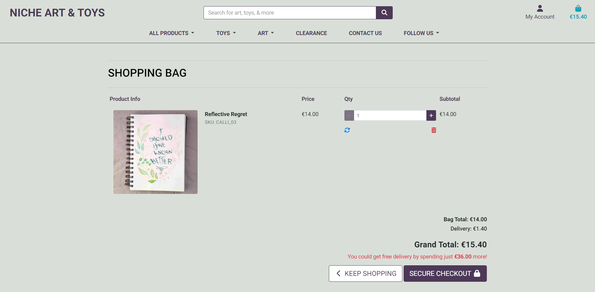

- On mobile devices, the shopping bag layout is optimized for usability. The total cost, including the bag total and delivery charges, is displayed at the top of the page to ensure visibility without the need to scroll through potentially long product lists.

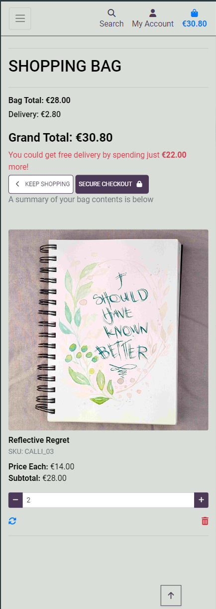

#### Checkout

- Users are required to fill out a form with their personal and delivery information to complete their orders. Fields include full name, email address, phone number, address, town or city, country, and postal code.
- Users who are logged in have the option to save their delivery information to their profile for faster future checkouts.
- The site uses Stripe in test mode for secure credit card processing. Users can enter the test card number 4242 4242 4242 4242 for payment simulations, with any future expiry date and CVC code.
- Adjust Bag: Allows users to return to their shopping bag to make changes before finalizing the purchase.
- Complete Order: Finalizes the transaction, charging the provided payment method.


- Upon successful completion of an order, users are directed to a "Thank You" page which displays a comprehensive summary of their order. This includes details such as the order number, order date, item(s) purchased with quantities and price, delivery address, and the grand total.
- Simultaneously, a toast message informs the user that the order has been successfully processed and a confirmation email has been sent to their registered email address.
- An email confirmation provides all the relevant order details and is sent automatically to ensure that the user has a record of their purchase.
- Registered users can view and manage their past orders by navigating to the "My Profile" section of the website, enhancing their experience and providing easy access to their transaction history.
- Users are encouraged to continue shopping with a button linking back to the product pages, facilitating ongoing engagement and purchases.

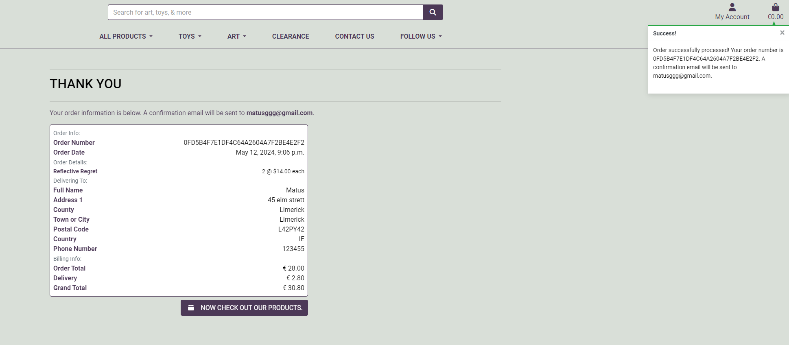

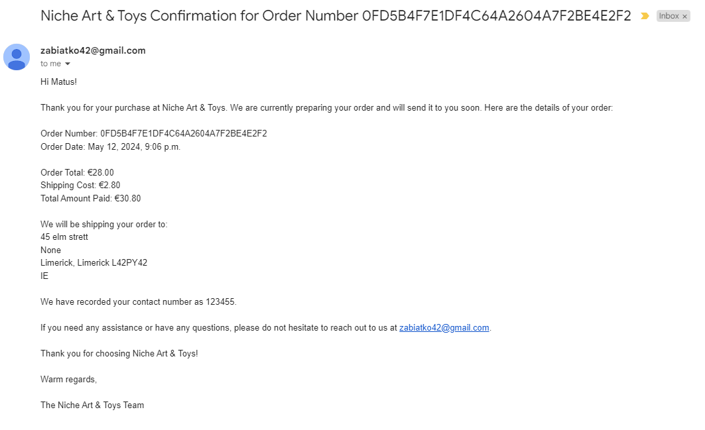

#### My Profile 

- Registered users can access their profile under "My Account" where they can view and update their default delivery information. The form is pre-filled with the details entered during previous checkouts, streamlining the process for future purchases.
- Users can view a summary of their past orders including order numbers, dates, items purchased, and totals. Clicking on an order number reopens the order confirmation page for that specific transaction, providing easy access to past order details.
- Users have the ability to update their personal and delivery information at any time. Changes are saved and will be used for future transactions.

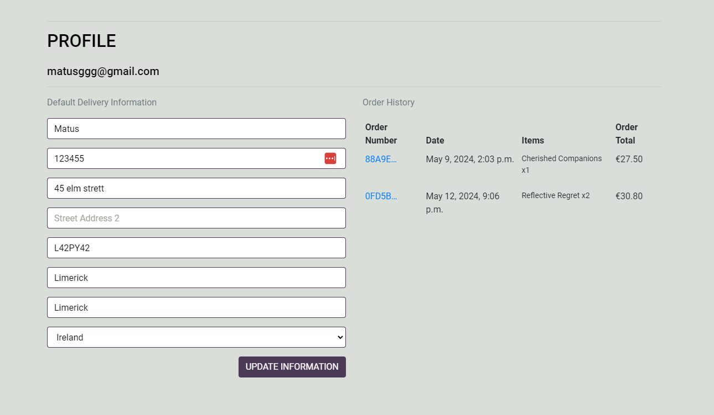

#### Contact Us
- Users can reach out via a user-friendly contact form by providing their name, email, subject, and message.
- Upon submission, users receive an immediate toast notification confirming that their message has been successfully sent and that they will be contacted by email shortly.
- Admin can review these messages directly from their dashboard and has ability to delete messages

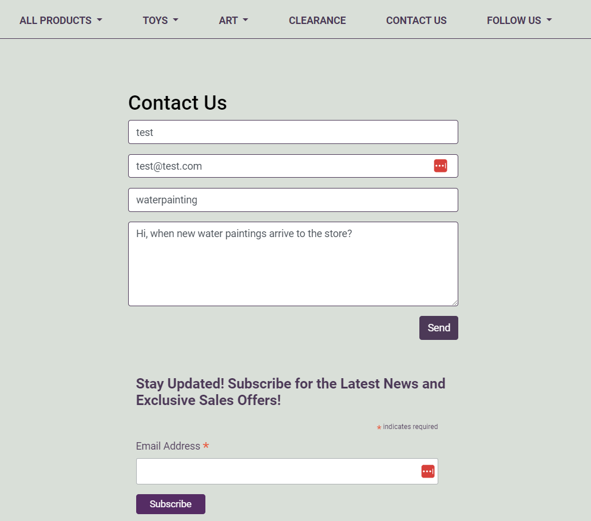

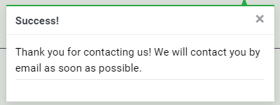


#### Wishlist
- Registered users can easily add products to their Wishlist, which they can access through the "My Account/Wishlist" section.
- Each item in the Wishlist is displayed as a product card, which includes important details such as product name, price, and available stock.
- Users can add items directly to their shopping bag from the Wishlist.
- Items can be removed from the Wishlist if the user decides against purchasing them or wishes to declutter their list.

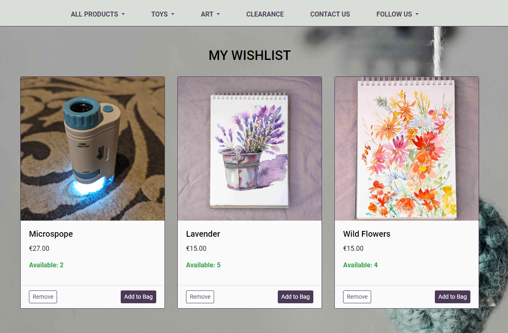

#### Admin Product Management
- Admin can add new products through the 'Product Management' section accessible from the admin dashboard.
- If no image is uploaded for the product, a placeholder image is automatically assigned.
- Upon successful addition of a product, a toast notification confirms the action with the message "Successfully added product!"
- Admins have the full capability to edit or delete any product listed on the site. This allows for direct control over inventory and product details directly from the admin dashboard.

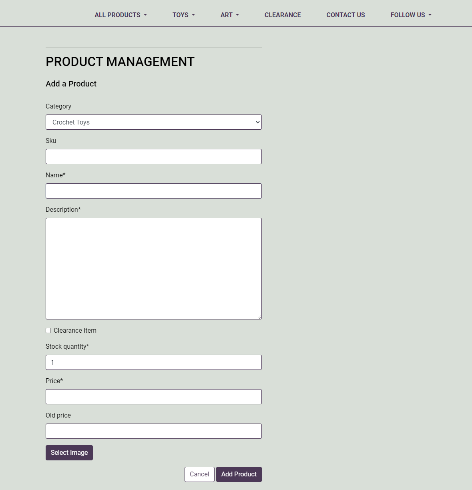

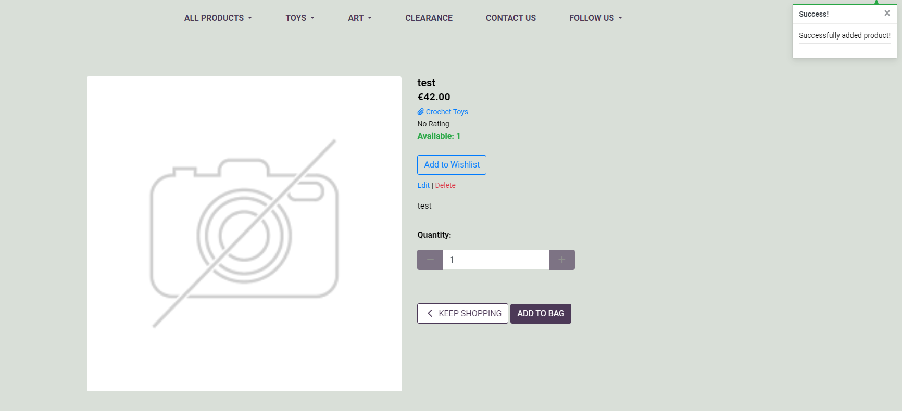

#### Admin Panel 
- Superusers in the admin panel have full access to all aspects of the site, including product details, orders, user accounts, and system settings. This centralized control ensures that admins can effectively manage and oversee the entire operation of the online store from a single interface.

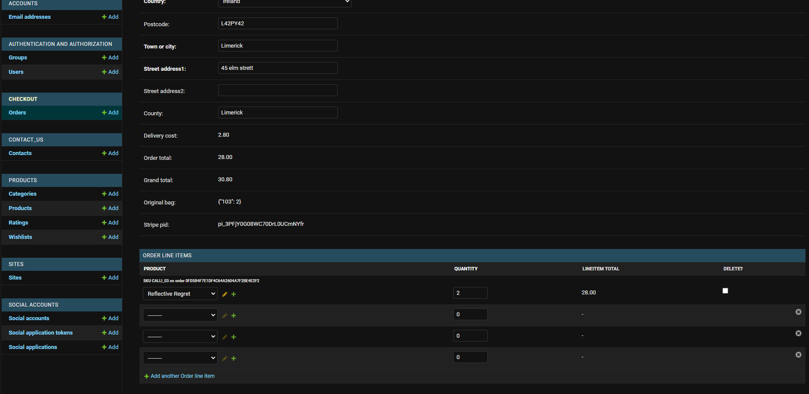