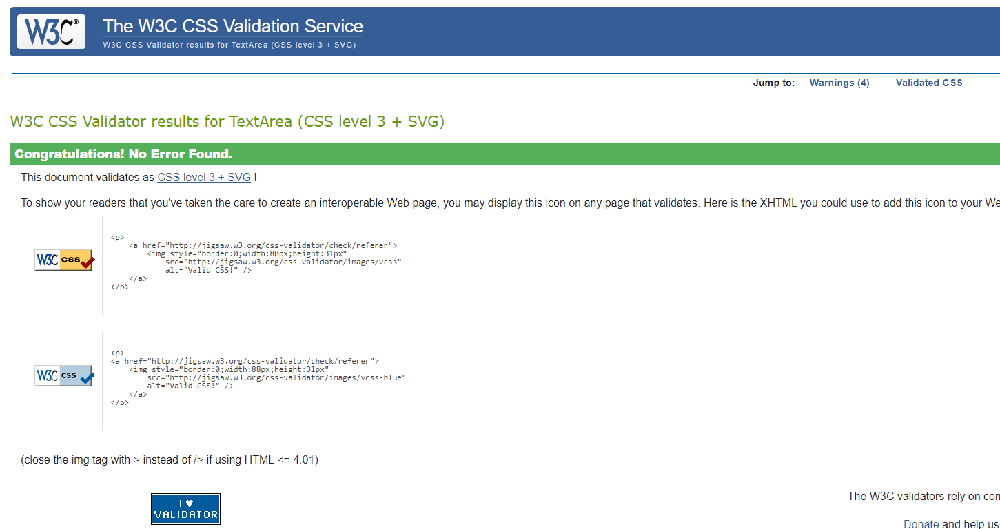
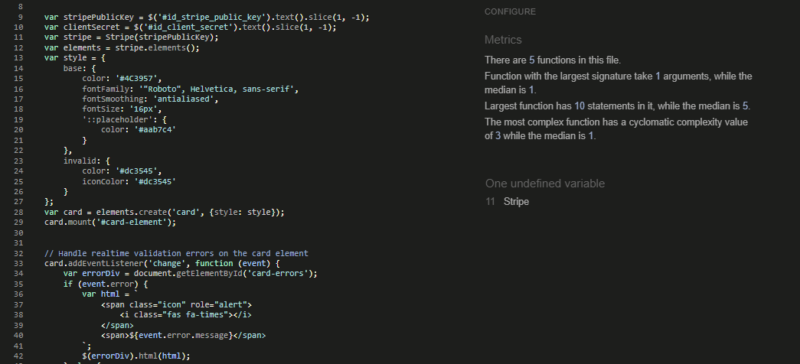

# **Table Of Contents**

* [**Validator Testing**](#validator-testing)
  * [**HTML**](#html)
  * [**CSS**](#css)
  * [**Javascript**](#javascript)
  * [**Python**](#python)
* [**WAVE Evaluation Tool**](#wave-evaluation-tool)
* [**Lighthouse Reports**](#lighthouse-reports)
* [**Manual Testing**](#manual-testing)
  * [**Responsiveness**](#responsiveness)
  * [**User Stories**](#user-stories)
  * [**Error Testing**](#error-testing)
* [**Automated Testing**](#automated-testing)
* [**Bugs**](#bugs)


## Validator Testing
### HTML
- All pages tested through direct input.
- i have few problems with double id's.
- Given the issue's complexity and my current time constraints, I plan to tackle this more thoroughly in the next update.

- Shopping Bag


- Add Product


- Edit Product


- All others came out with no error.
- Home Page


- Main Product Page


- Product Detail


- Checkout


### CSS
- All css checkt via direct input
- Checkout css


- Base css - 4 warnings




- Profiles css


- Contact css


### Javscript
- Tested my js through JSHint 


- Stripe js




### Python
- I checked all Python files with Flake8 locally and the CI Python linter. Both indicated that only system files have errors, which we shouldn't alter. All other files passed without any issues.

- Bag view


- Checkout view


- Contact Us view


- Profiles view


## WAVE Evaluation Tool
- There are issues with headings being skipped or not starting with an h1 as the first heading.
  (planning to fix this later as i run out of time, can implement proper headings and then change font size)
- There are errors related to empty form labels; placeholders are being used to describe form fields. (mailchimp)
- Tried to remove all the contrast issues but some may remain.


## Lighthouse Reports

### Home Page
- Desktop


- Mobile


### All Products Page
- Desktop


- Mobile


### Product Detail Page
- Desktop


- Mobile


### Shopping Bag Page
- Desktop


- Mobile


### Checkout Page
- Desktop


- Mobile


### Contact Us Page
- Desktop


- Mobile


### Profile Page
- Desktop


- Mobile


### Wishlist Page
- Desktop


- Mobile


## Manual Testing

### Responsiveness 

- I ensured that my e-commerce platform provides a seamless user experience across a variety of devices and browsers.
- I used the responsive design modes in Google Chrome, Mozilla Firefox, and Microsoft Edge to emulate various devices.
- I conducted thorough testing on Google Chrome, Mozilla Firefox, and Microsoft Edge.

### User Stories
#### Viewing and Navigation Testing

| Feature                          | User Story                                                                                   | Test Case Description                                             | Expected Outcome                                                         | Actual Outcome     |
|----------------------------------|----------------------------------------------------------------------------------------------|-------------------------------------------------------------------|-------------------------------------------------------------------------|--------------------|
| **View All Products**            | As a Shopper, I want to view a list of all products.                                         | Navigate to the main product listing page.                        | All available products should be listed.                                | Work as expected.✅                 |
| **Product Details**              | As a Shopper, I want to view detailed information about each product.                        | Click on a product to access its detailed view.                   | Product details page displays all information about the product.        | Product detail displayed correctly. ✅               |
| **Identify Deals**               | As a Shopper, I want to identify deals and limited-time offers.                              | Check the homepage or deals section for current offers.           | Deals and limited-time offers are clearly highlighted.                  | Products on offer are marked with clearence badge and price is visibly reduced. ✅               |
| **Expenditure Visibility**       | As a Shopper, I want to easily see my potential expenditures.                                | Add products to cart and view the cart total.                     | Cart should display the total cost of added items.                      | Price is updating correctly under shopping bag icon. ✅                |
| **Sort Products**                | As a Shopper, I want to sort products by various attributes such as rating or price.         | Use sorting options on the product listing page.                  | Products should reorder according to the selected sorting option.       | All sorting work as expected. ✅                |
| **Category Sorting**             | As a Shopper, I want to sort through a specific category.                                    | Select a category from the category menu.                         | Only products from the selected category should be displayed.           | Work as expected. ✅                |
| **Search Functionality**         | As a Shopper, I want to search for products by name or description.                          | Use the search bar to enter a query.                              | Products matching the search query should be displayed.                 | Work as expected, informs if no result found. ✅                |
| **Search Results and Quantity**  | As a Shopper, I want to see the results of my search and the quantity of matches.            | Perform a search and view the number of results returned.         | The number of products found should be clearly indicated.               | Works as expected. ✅                |


#### Registration and User Accounts Testing

| Feature                          | User Story                                                                                   | Test Case Description                                             | Expected Outcome                                                         | Actual Outcome     |
|----------------------------------|----------------------------------------------------------------------------------------------|-------------------------------------------------------------------|-------------------------------------------------------------------------|--------------------|
| **User Registration**            | As a Site User, I want to register for an account effortlessly.                               | Complete the registration form with valid details.                | If username or email is already registered user canot create account.    | Works as expected. ✅                |
| **Login/Logout**                 | As a Site User, I want to log in or out with ease.                                           | Log in with valid credentials and then log out.                   | Successful login followed by successful logout.                         | Works as expected. ✅                 |
| **Password Recovery**            | As a Site User, I want to recover my password smoothly if I forget it.                       | Use the 'Forgot Password' feature with a registered email.        | Instructions for password recovery should be sent to the email address. | User can reset password. Work as expected. ✅                |
| **Signup Confirmation**          | As a Site User, I want to receive confirmation after signing up.                             | Check email after registration for a confirmation message.        | A confirmation email should be received shortly after registration.     | Confirmation email received. ✅                |
| **User Profile Management**      | As a Site User, I want to have my own user profile to track my orders and save my preferences.| Log into the account and view the profile page.                   | User profile should display personal info and order history.            | User can access "My Profile", fill info and save. ✅                |


#### Purchasing and Checkout Testing

| Feature                          | User Story                                                                                   | Test Case Description                                             | Expected Outcome                                                         | Actual Outcome     |
|----------------------------------|----------------------------------------------------------------------------------------------|-------------------------------------------------------------------|-------------------------------------------------------------------------|--------------------|
| **Select Product Quantity**      | As a Shopper, I want to easily select the quantity of a product when purchasing it.          | Change the quantity of an item in the product detail view.        | Quantity should update accordingly in the interface.                    | User can input quantity with plus button or decrease with minus button. Can go up to a number limited by product stock quantity. ✅                |
| **Cart Review**                  | As a Shopper, I want to review items in my cart before purchasing.                           | View the shopping cart after adding items.                        | All added items should be listed with correct details and totals.       | All details can be seen. ✅                 |
| **Cart Modification**            | As a Shopper, I want to adjust quantities or remove items in my cart.                        | Change quantities and remove an item from the cart.               | Cart updates with new totals and reflects changes immediately.          | Works as expected. ✅                |
| **Secure Payment**               | As a Shopper, I want to enter my payment information on a secure page.                       | Proceed to checkout and enter payment details on the payment page.| Payment information is processed through a secure connection.           | Payment is handled via Stripe. ✅                |
| **Order Summary**                | As a Shopper, I want to see a summary of my order upon completion.                           | Complete a purchase and view the order summary page.              | Order summary displays all pertinent details of the completed order.    | Thank You page with order details displayed. ✅                |
| **Email Confirmation**           | As a Shopper, I want to receive an email confirmation after my purchase.                     | Check email after completing a purchase.                          | An email confirmation of the order should be received.                  | Confimation email received. ✅                |
| **Product Rating**               | As a Shopper, I want to rate products using a star system.                                   | Submit a star rating for a purchased product.                     | Rating should be recorded and displayed on the product page.            | Registered user can rate product, on product average rate is displayed. Users can edit or delete their ratings. ✅                |
| **Writing Comment**              | As a Shopper, I want to write comments for products I've purchased.                           | Submit a comment for a product.                                    | Comment should be posted under the product.               | Registered users can comment product along with rating. ✅                |


#### Store Management and Engagement Testing

| Feature                          | User Story                                                                                   | Test Case Description                                             | Expected Outcome                                                         | Actual Outcome     |
|----------------------------------|----------------------------------------------------------------------------------------------|-------------------------------------------------------------------|-------------------------------------------------------------------------|--------------------|
| **Add New Products**             | As a Store Owner, I want to add new products.                                                | Use the admin panel to create a new product listing.              | New product should appear on the website.                               | Works as expected through fronted interface as well as through admin panel✅                |
| **Edit/Update Product**          | As a Store Owner, I want to edit/update a product.                                           | Update product details through the admin panel.                   | Changes should be reflected immediately on the product's page.          | Admin can edit edit product through edit button on product or through admin interface. ✅                |
| **Delete Product**               | As a Store Owner, I want to delete a product.                                                | Remove a product listing via the admin panel.                     | Product should no longer appear on the site.                            | Works as expected. If try to delete modal appears to reasure. ✅                |
| **Promote Products**             | As a Store Owner, I want to promote my products via a Facebook page.                                  | Set up a Facebook page for the store and create a promotional post featuring a specific product with details and a link back to the product page on the website.              | The Facebook post is successfully published and includes accurate product details, an appealing image, and a direct link to the product on the e-commerce site.                       | TBD                |


#### Additional User Interaction Testing

| Feature                          | User Story                                                                                   | Test Case Description                                             | Expected Outcome                                                         | Actual Outcome     |
|----------------------------------|----------------------------------------------------------------------------------------------|-------------------------------------------------------------------|-------------------------------------------------------------------------|--------------------|
| **Contact Us Form**              | As a Site User, I want to easily access and submit the contact us form.                      | Navigate to the contact page and submit a query.                 | Query is submitted successfully, and a confirmation message is shown.   | After submiting users can see toast message that they will be contacted via submited email address. ✅                 |
| **Manage Wishlist**              | As a Shopper, I want to add items to a Wishlist so that I can save them for later.           | Add a product to the Wishlist and view the Wishlist.              | Product appears in the Wishlist.                                        | Registered users can add product to wishlist simply by clicking "Add to Wishlist" and then they can find their wishlist in "my account". Items from wishlist can be added to shopping bag or removed from wishlist. ✅                |


### Error Testing

- A custom 404 error page is displayed whenever a user attempts to access a page that does not exist on the website.


## Bugs 

### Bug 1: Incomplete Product Detail Page Rendering

**Symptoms:**
- Product detail page only shows a currency symbol and "No Rating" message.
- Missing product name, description, image, and other details.

**Cause:**
- Mismatch between the view's context dictionary key and the template's expected variable. The view passed a collection named `products` instead of a single `product` object.

**Resolution:**
- Updated the dictionary key in the view's context from `products` to `product`.

**Steps to Resolve:**
1. Identify the mismatch in variable naming conventions between the view and template.
2. Update the context dictionary key in the view to ensure proper data passing to the template.


### Bug 2: Template Parsing Error in Django

**Symptoms:**
- Django template error: "Could not parse the remainder: '==1' from 'rating.score==1'."

**Cause:**
- Incorrect syntax in Django template tags, missing spaces around the `==` operator within `` conditions.

**Resolution:**
- Corrected the syntax by adding spaces around the equality operator in the template conditions.

**Steps to Resolve:**
1. Review the Django template for syntax errors.
2. Update `` to `` in the `rating_and_comments.html`.

### Bug 3: ModuleNotFoundError During Django Migration

**Symptoms:**
- Encountered a `ModuleNotFoundError` related to `pkg_resources` during a dry-run migration after adding Django CountryFields to the model.

**Cause:**
- Missing or outdated `setuptools` package, which includes `pkg_resources`, needed by Django CountryFields.

**Resolution:**
- Upgraded `setuptools` in the virtual environment.

**Steps to Resolve:**
1. Check virtual environment activation.
2. Execute `pip install --upgrade setuptools` in the terminal.
3. Successfully re-run the migration command.

### Bug 4: Site Crash When Refreshing Shopping Bag After Product Deletion

**Symptoms:**
- The site crashes when a user refreshes the shopping bag after a product has been deleted from the database. This issue mirrors similar behavior observed in Boutique Ado.

**Cause:**
- The system attempts to access details of a deleted product stored in the user's session data during the shopping bag refresh, leading to a failure because the product no longer exists in the database.

**Resolution:**
- Implement session data cleanup and validation checks during the shopping bag refresh to ensure all products in the basket still exist in the database.

**Steps to Resolve:**
1. **Clear Session on Deletion:** Immediately clear any session data related to the shopping bag that references the deleted product.
2. **Validation During Shopping Bag Refresh:** Introduce a validation step when the shopping bag is refreshed to confirm the existence of all items in the basket within the database. Remove any items that have been deleted from the database before allowing the user to see the updated bag.
3. **Improved User Feedback:** Provide feedback to users when items are removed from their basket during the refresh of the shopping bag to inform them of changes due to product unavailability.

**Implementation Example:**

```python
from django.shortcuts import redirect
from django.contrib import messages
from products.models import Product

def clean_shopping_bag(request):
    """Remove non-existent products from the shopping bag."""
    bag = request.session.get('bag', {})
    cleaned_bag = {}
    has_changes = False

    for item_id, quantity in bag.items():
        if Product.objects.filter(id=item_id).exists():
            cleaned_bag[item_id] = quantity
        else:
            has_changes = True
            messages.error(
                request,
                "Some items in your bag were not found and have been removed.")
    if has_changes:
        request.session['bag'] = cleaned_bag

def view_bag(request):
    """ A view that renders the bag contents page """
    request.session['show_bag_message'] = False
    clean_shopping_bag(request)
    return render(request, 'bag/bag.html')

